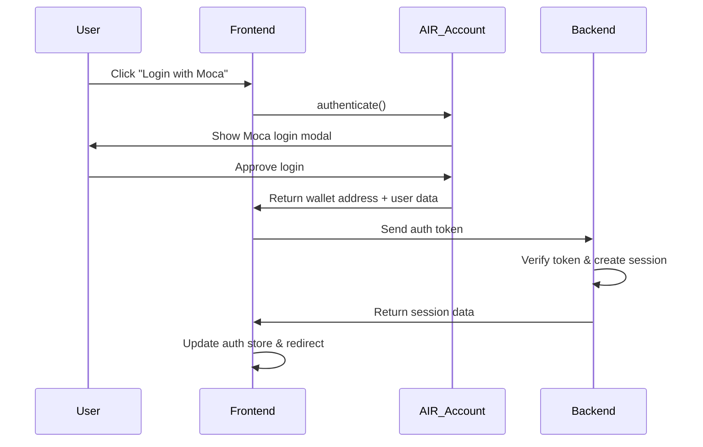
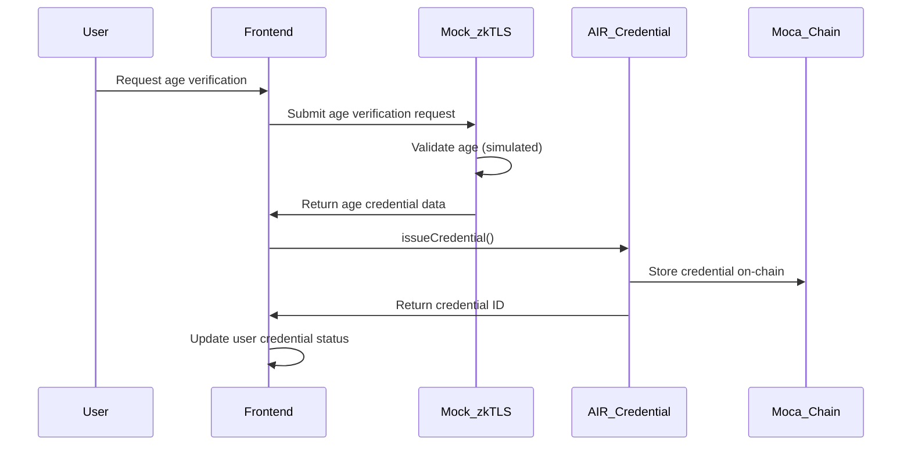
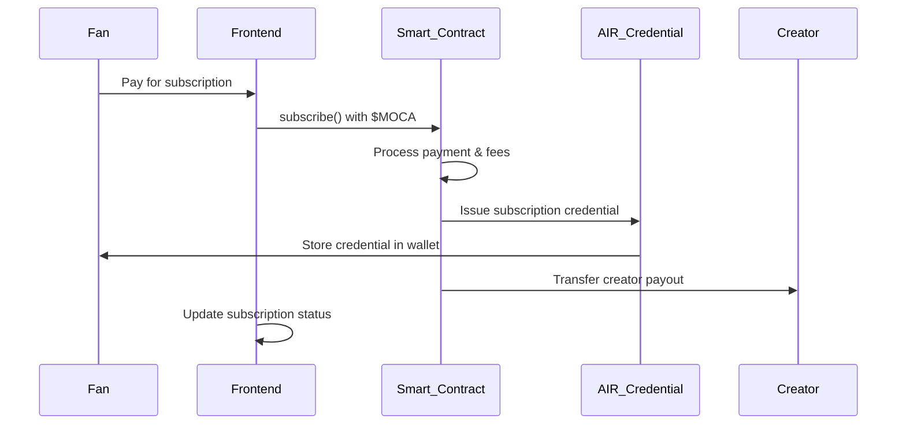
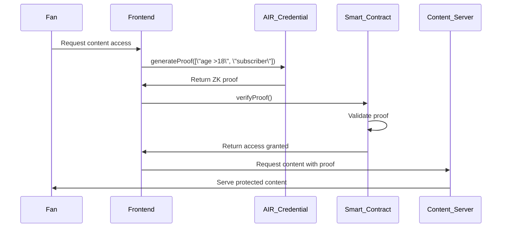
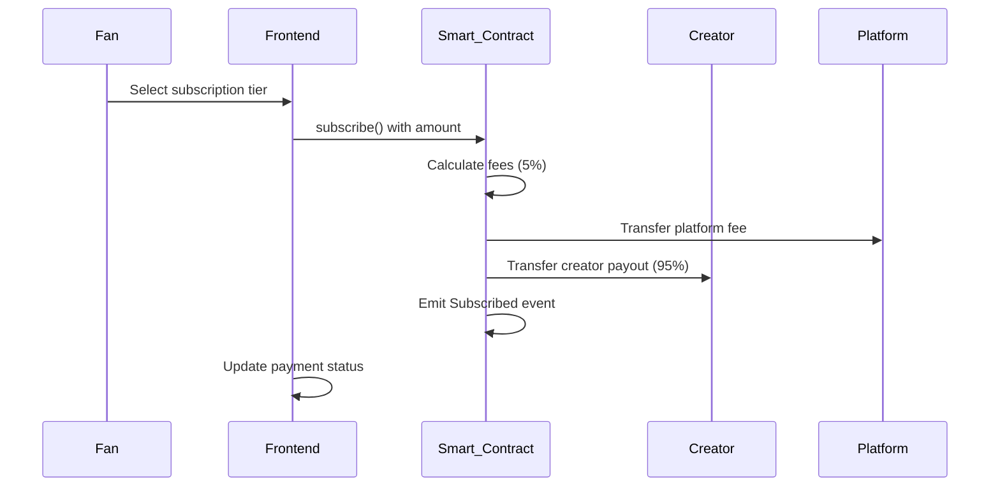
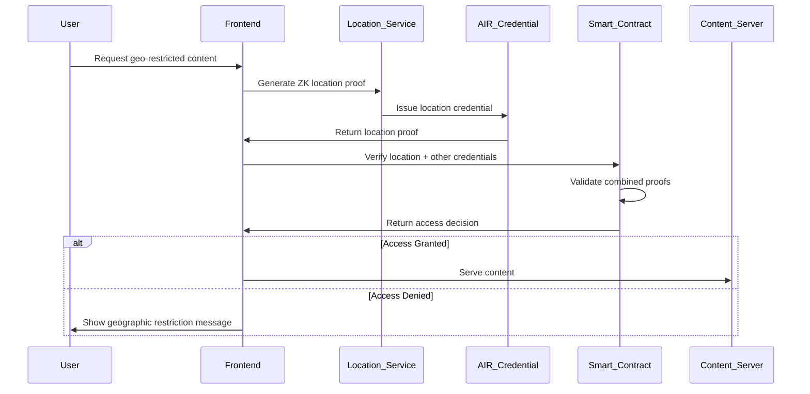
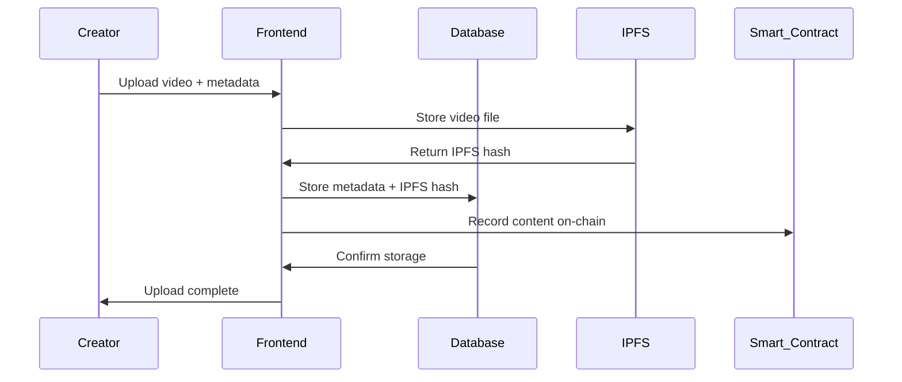
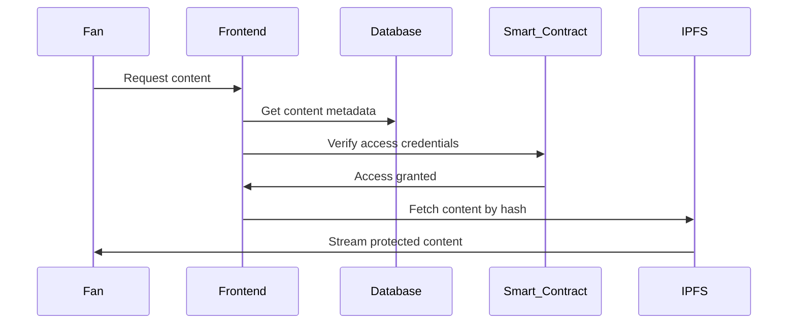

# Enclave Implementation Guide

**Version:** 2.0  
**Last Updated:** October 19, 2025  
**Status:** Active Development

## Overview

This document provides a comprehensive implementation guide for the Enclave data monetization marketplace, detailing specific Moca SDK integrations, smart contract implementations, and feature development across all platform components.

## Technology Stack

### Frontend

- **Framework**: SvelteKit 5 (TypeScript)
- **Styling**: TailwindCSS
- **Icons**: Lucide Svelte
- **State Management**: Svelte stores

### Blockchain

- **Network**: Moca Chain
- **Smart Contracts**: Solidity ^0.8.20
- **Development**: Hardhat
- **Testing**: Hardhat + Chai

### Moca Network Integration

- **AIR Account SDK**: Authentication & wallet management
- **AIR Credential SDK**: ZK credential issuance & verification
- **zkTLS**: Zero-knowledge proof generation

---

## Implementation Categories

1. [Authentication & Identity](#1-authentication--identity-management)
2. [Credential System](#2-credential-system)
3. [Marketplace](#3-marketplace-implementation)
4. [Trust System](#4-trust-system-vouching--slashing)
5. [Smart Contracts](#5-smart-contract-implementation)
6. [UI/UX Components](#6-uiux-components)
7. [Testing & Deployment](#7-testing--deployment)

---

## 1. Authentication & Identity Management

### 1.1 Moca SSO Integration (AIR Account Services)

**Purpose:** Web3 wallet-based authentication for all users

**Moca SDK Tool:** `@moca/air-account-sdk`

**Key Methods:**

- `authenticate()` - Connect wallet and authenticate
- `disconnect()` - Sign out user
- `isConnected()` - Check authentication status
- `getWalletAddress()` - Get user's wallet address

**Implementation Location:**

```
src/lib/services/
├── mocaAuth.ts              # Authentication service
└── useAirKit.ts             # AIR Kit wrapper

src/routes/
├── auth/
│   └── +page.svelte         # Login page
└── +layout.svelte           # Auth check wrapper
```

**Code Implementation:**

```typescript
// src/lib/services/mocaAuth.ts
import { AIRAccountSDK } from '@moca/air-account-sdk';
import { writable } from 'svelte/store';

class MocaAuthService {
	private sdk: AIRAccountSDK;
	public user = writable<{ address: string } | null>(null);

	constructor() {
		this.sdk = new AIRAccountSDK({
			partnerId: import.meta.env.PUBLIC_PARTNERID,
			environment: 'staging'
		});
	}

	async login(): Promise<string> {
		try {
			const { walletAddress } = await this.sdk.authenticate();
			this.user.set({ address: walletAddress });
			return walletAddress;
		} catch (error) {
			console.error('Login failed:', error);
			throw error;
		}
	}

	async logout(): Promise<void> {
		await this.sdk.disconnect();
		this.user.set(null);
	}

	isAuthenticated(): boolean {
		return this.sdk.isConnected();
	}
}

export const mocaAuth = new MocaAuthService();
```

**Reason:**

- No password management required
- Seamless integration with Moca ecosystem
- Secure wallet-based authentication
- Cross-platform identity

**User Interactions:**

1. User clicks "Connect Wallet"
2. Moca wallet prompt appears
3. User approves connection
4. User authenticated, redirected to dashboard

---

## 2. Credential System

### 2.1 Credential Issuance with zkTLS

**Purpose:** Create Zero-Knowledge credentials from user data

**Moca SDK Tool:** `@moca/air-credential-sdk`

**Key Methods:**

- `issueCredential()` - Issue new credential
- `verifyCredential()` - Verify credential validity
- `revokeCredential()` - Revoke credential

**Implementation Location:**



**Code Implementation:**

```svelte
<!-- src/lib/components/MocaLogin.svelte -->
<script>
	import { authenticate, getUserProfile } from '@mocanetwork/airkit';
	import { authStore } from '$lib/stores/auth';

	async function handleLogin() {
		try {
			const wallet = await authenticate();
			const profile = await getUserProfile();
			authStore.set({ wallet, profile, isAuthenticated: true });
		} catch (error) {
			console.error('Login failed:', error);
		}
	}
</script>
```

---

## 2. Credential Issuance & Verification

### 2.1 Age Verification Credential Issuance

**Implementation:** Issue "Over 18" and "Over 21" credentials using implementing zkTLS API

**Moca SDK Tool:** `@mocanetwork/airkit` - Credential Services

- **Primary Method:** `issueCredential()`
- **Schema:** Age verification schema (18+, 21+)

**Implementation Location:**

- **Frontend:** `src/lib/components/AgeVerification.svelte`
- **Backend:** `src/routes/api/credentials/age/+server.ts`
- **Mock Service:** `src/lib/services/zktls-mock.ts`

**Reason:**

- Comply with age verification requirements for adult content
- Use zero-knowledge proofs to protect user privacy
- Enable tiered access based on age verification levels
- Simulate real-world integration with identity providers

**Interactions:**



### 2.2 Subscription Credential Issuance

**Implementation:** Issue "Subscriber" and "Premium Subscriber" credentials upon payment

**Moca SDK Tool:** `@mocanetwork/airkit` - Credential Services

- **Primary Method:** `issueCredential()`
- **Schema:** Subscription schema (tier, creator, expiry)

**Implementation Location:**

- **Smart Contract:** `contracts/SubscriptionContract.sol`
- **Backend:** `src/routes/api/credentials/subscription/+server.ts`
- **Frontend:** `src/lib/components/PaymentFlow.svelte`

**Reason:**

- Link payment status to verifiable credentials
- Enable access control without exposing payment history
- Create portable subscription status across platforms
- Prevent subscription fraud and sharing

**Interactions:**



### 2.3 ZK Proof Verification for Content Access

**Implementation:** Verify combined credentials ("Over 18" + "Subscriber") for content access

**Moca SDK Tool:** `@mocanetwork/airkit` - Credential Services

- **Primary Method:** `generateProof()`, `verifyProof()`
- **Smart Contract Integration:** `ZKVerificationContract.sol`

**Implementation Location:**

- **Frontend:** `src/lib/components/ContentGate.svelte`
- **Smart Contract:** `contracts/ZKVerificationContract.sol`
- **Backend:** `src/routes/api/verify/+server.ts`

**Reason:**

- Ensure only eligible users access gated content
- Maintain user privacy (no personal data exposed)
- Prevent unauthorized access and content piracy
- Enable complex access rules (age + subscription + NFT ownership)

**Interactions:**



---

## 3. Payment Processing

### 3.1 $MOCA Subscription Payments

**Implementation:** Process subscription payments in $MOCA with platform fees

**Moca SDK Tool:** Native Moca Chain integration (Web3/ethers.js)

- **Smart Contract:** `SubscriptionContract.sol`
- **Token:** $MOCA (native Moca Chain token)

**Implementation Location:**

- **Smart Contract:** `contracts/SubscriptionContract.sol`
- **Frontend:** `src/lib/components/PaymentFlow.svelte`
- **Backend:** `src/routes/api/payments/+server.ts`

**Reason:**

- Use native Moca ecosystem token for seamless integration
- Implement transparent fee structure (5% platform fee)
- Enable instant payments without traditional payment processors
- Support creator payouts in cryptocurrency

**Interactions:**



### 3.2 Creator Staking & Governance

**Implementation:** Allow creators to stake $MOCA for tier promotion and governance participation

**Moca SDK Tool:** Native Moca Chain integration

- **Smart Contract:** `GovernanceContract.sol`

**Implementation Location:**

- **Smart Contract:** `contracts/GovernanceContract.sol`
- **Frontend:** `src/routes/creator/governance/+page.svelte`
- **Backend:** `src/routes/api/governance/+server.ts`

**Reason:**

- Incentivize high-quality content creation
- Provide mechanism to slash stakes for policy violations
- Enable community governance for platform rules
- Create economic incentives for platform participation

---

## 4. Content Access Control

### 4.1 Gated Content Delivery

**Implementation:** Serve content only to verified credential holders

**Moca SDK Tool:** AIR Credential Services for verification

- **Method:** `verifyCredential()`

**Implementation Location:**

- **Frontend:** `src/lib/components/ContentPlayer.svelte`
- **Backend:** `src/routes/api/content/[id]/+server.ts`
- **Middleware:** `src/lib/middleware/accessControl.ts`

**Reason:**

- Enforce subscription tiers and age requirements
- Protect creator content from unauthorized access
- Enable fine-grained access control rules
- Support multiple verification criteria combinations

### 4.2 Location-Based Access Controls

**Implementation:** Geographic content restrictions with ZK location proofs

**Moca SDK Tool:** AIR Credential Services for location verification

- **Primary Method:** `verifyLocationCredential()`
- **Schema:** Location verification schema (country, region)

**Implementation Location:**

- **Frontend:** `src/lib/components/LocationVerification.svelte`
- **Smart Contract:** `contracts/LocationVerificationContract.sol`
- **Backend:** `src/routes/api/credentials/location/+server.ts`
- **Middleware:** `src/lib/middleware/geoAccessControl.ts`

**Reason:**

- Comply with regional content regulations and licensing requirements
- Enable creators to control geographic distribution of content
- Protect user privacy by not storing IP addresses or exact locations
- Use zero-knowledge proofs to verify location eligibility without exposure

**Interactions:**



### 4.3 Dynamic Content Routing

**Implementation:** Route users to appropriate content based on credentials and location

**Implementation Location:**

- **Frontend:** `src/routes/content/+layout.svelte`
- **Route Guards:** `src/lib/guards/credentialGuard.ts`
- **Location Guards:** `src/lib/guards/locationGuard.ts`

**Reason:**

- Provide personalized content experience based on all eligibility criteria
- Hide unavailable content from non-qualified users
- Enable smooth user journey progression
- Support different content categories and restrictions

---

## 5. Smart Contract Integration

### 5.1 Subscription Management Contract

**Implementation:** Core contract for handling subscriptions, payments, and credential issuance

**Smart Contract:** `SubscriptionContract.sol`

**Key Functions:**

- `subscribe(address creator, uint256 amount, string tier)`
- `cancelSubscription(address creator)`
- `updateSubscription(address creator, string newTier)`
- `getSubscriptionStatus(address fan, address creator)`

**Implementation Location:**

- **Contract:** `contracts/SubscriptionContract.sol`
- **Deployment:** Deploy to Moca Chain testnet
- **Integration:** `src/lib/contracts/subscription.ts`

### 5.2 ZK Verification Contract

**Implementation:** Verify zero-knowledge proofs for content access

**Smart Contract:** `ZKVerificationContract.sol`

**Key Functions:**

- `verifyProof(address user, bytes proof, string[] requiredCredentials)`
- `updateAccessRules(string contentId, string[] requirements)`
- `checkAccess(address user, string contentId)`

---

## 6. Ecosystem Integration

### 6.1 Animoca Apps Integration

**Implementation:** Verify Mocaverse NFT and OneFootball fan credentials

**Moca SDK Tool:** External API integration + AIR Credential Services

**Implementation Location:**

- **Backend:** `src/routes/api/ecosystem/+server.ts`
- **Services:** `src/lib/services/animoca.ts`

**Reason:**

- Leverage Animoca's 700M+ user ecosystem
- Provide loyalty benefits for existing Animoca users
- Enable cross-platform credential recognition
- Drive user acquisition from partner platforms

### 6.2 Iframe Embedding

**Implementation:** Embeddable widget for Animoca apps

**Implementation Location:**

- **Component:** `src/lib/components/IframePlugin.svelte`
- **Standalone:** `src/routes/embed/+page.svelte`

**Reason:**

- Enable seamless integration with partner apps
- Expand reach without requiring app switching
- Provide white-label solution for partners
- Increase user engagement and acquisition

---

## 7. Data Storage & Analytics

### Overview: Hybrid Storage Architecture

**Enclave requires BOTH database and decentralized storage:**

1. **Database (PostgreSQL/SQLite)** - For operational data, sessions, caching
2. **IPFS/Moca Chain Storage (MCSP)** - For content, credentials, immutable records
3. **Smart Contracts** - For payments, subscriptions, access control

### 7.1 Database Storage (PostgreSQL)

**Implementation:** Traditional database for operational data and fast queries

**Database Tool:** PostgreSQL with Prisma ORM

**Implementation Location:**

- **Schema:** `prisma/schema.prisma`
- **Migrations:** `prisma/migrations/`
- **Backend:** `src/lib/database/`

**Data Stored:**

- User sessions and temporary auth tokens
- Creator profiles and dashboard settings
- Content metadata (titles, descriptions, pricing)
- Subscription tiers configuration
- Analytics data (aggregated, non-PII)
- Payment transaction logs
- Platform configuration and settings

**Reason:**

- Fast queries for real-time dashboard updates
- Complex relational queries for analytics
- Session management and caching
- Temporary data that doesn't need immutability
- Performance optimization for user experience

**Database Schema:**

```sql
-- Core user data (non-sensitive)
CREATE TABLE users (
  id UUID PRIMARY KEY,
  wallet_address VARCHAR(42) UNIQUE,
  user_type VARCHAR(20), -- 'creator' or 'fan'
  created_at TIMESTAMP,
  last_active TIMESTAMP
);

-- Creator profile data
CREATE TABLE creator_profiles (
  id UUID PRIMARY KEY,
  user_id UUID REFERENCES users(id),
  display_name VARCHAR(100),
  bio TEXT,
  profile_image_url VARCHAR(255),
  social_links JSONB
);

-- Subscription tiers (pricing/rules)
CREATE TABLE subscription_tiers (
  id UUID PRIMARY KEY,
  creator_id UUID REFERENCES users(id),
  name VARCHAR(50),
  price_moca DECIMAL(18,8),
  access_rules JSONB, -- ZK credential requirements
  created_at TIMESTAMP
);

-- Content metadata (not the actual content)
CREATE TABLE content_items (
  id UUID PRIMARY KEY,
  creator_id UUID REFERENCES users(id),
  title VARCHAR(200),
  description TEXT,
  content_type VARCHAR(50),
  ipfs_hash VARCHAR(64), -- Reference to IPFS storage
  tier_id UUID REFERENCES subscription_tiers(id),
  created_at TIMESTAMP
);

-- Analytics (aggregated, no PII)
CREATE TABLE analytics_events (
  id UUID PRIMARY KEY,
  event_type VARCHAR(50),
  creator_id UUID,
  tier_id UUID,
  count INTEGER,
  date DATE,
  metadata JSONB
);
```

### 7.2 IPFS/Moca Chain Storage (MCSP Network)

**Implementation:** Decentralized storage for content and immutable records

**Moca SDK Tool:** Moca Chain Storage Provider Network (MCSP)

- **Content Storage:** IPFS integration via MCSP
- **Metadata:** On-chain storage for credentials and transactions

**Implementation Location:**

- **Backend:** `src/lib/services/ipfsStorage.ts`
- **Integration:** `src/lib/services/mocaStorage.ts`

**Data Stored:**

- **Actual content files** (videos, images, NFTs)
- **ZK credentials** and proofs
- **Subscription transaction records**
- **Content access logs** (for creator analytics)
- **Immutable audit trails**

**Reason:**

- Decentralized content delivery (CDN-like)
- Immutable credential and transaction records
- Cross-chain portability of credentials
- Censorship resistance for content
- Integration with Moca Network ecosystem

**IPFS Integration:**

```typescript
// src/lib/services/ipfsStorage.ts
import { create } from 'ipfs-http-client';

export class IPFSService {
	private ipfs = create({
		host: 'ipfs.moca.network', // Moca's IPFS gateway
		port: 5001,
		protocol: 'https'
	});

	async uploadContent(file: File): Promise<string> {
		const result = await this.ipfs.add(file);
		// Store IPFS hash in database for quick retrieval
		await this.storeContentMetadata(result.path);
		return result.path; // Returns IPFS hash
	}

	async getContent(ipfsHash: string): Promise<Blob> {
		const stream = this.ipfs.cat(ipfsHash);
		// Return content stream
	}
}
```

### 7.3 Smart Contract Storage (Moca Chain)

**Implementation:** On-chain storage for critical transactional data

**Smart Contract Storage:**

- Subscription payments and status
- ZK proof verification results
- Creator staking amounts
- Platform governance votes

**Implementation Location:**

- **Contracts:** `contracts/SubscriptionContract.sol`
- **Integration:** `src/lib/contracts/`

### 7.4 Hybrid Storage Strategy

**Content Upload Flow:**



**Content Access Flow:**



### 7.5 Why Both Are Needed

**Database Advantages:**
✅ Fast queries for dashboards and analytics
✅ Complex joins and aggregations
✅ Session management and caching  
✅ Cost-effective for frequently changing data
✅ Better UX performance

**IPFS/Moca Storage Advantages:**
✅ Decentralized and censorship-resistant
✅ Immutable records for compliance
✅ Cross-chain credential portability
✅ Integration with Moca ecosystem
✅ Reduced storage costs for large files

**Combined Benefits:**

- **Fast user experience** (database for UI)
- **Decentralized content** (IPFS for files)
- **Immutable records** (blockchain for transactions)
- **Privacy preservation** (ZK credentials off-chain)
- **Scalability** (hybrid approach optimizes costs)

### 7.6 Privacy-Preserving Analytics

**Implementation:** Collect anonymized analytics without exposing user data

**Implementation Location:**

- **Frontend:** `src/lib/analytics/privacy.ts`
- **Backend:** `src/routes/api/analytics/+server.ts`
- **Storage:** Database (aggregated) + IPFS (detailed logs)

**Reason:**

- Provide creators with valuable insights
- Maintain user privacy and compliance
- Support platform optimization decisions
- Enable data monetization features

---

## Implementation Timeline

### Phase 1: Core Authentication & Payments (Days 1-3)

1. Moca Login integration
2. Basic subscription payments
3. Age verification credentials

### Phase 2: Advanced Features (Days 4-7)

1. ZK proof verification
2. Premium tier support
3. Smart contract deployment

### Phase 3: Ecosystem Integration (Days 8-10)

1. Animoca platform integration
2. Iframe embedding
3. Analytics and monitoring

---

## SDK Dependencies

```json
{
	"dependencies": {
		"@mocanetwork/airkit": "^latest",
		"ethers": "^6.0.0",
		"@wagmi/core": "^latest",
		"svelte": "^4.0.0",
		"@sveltejs/kit": "^latest"
	}
}
```

## Environment Configuration

```typescript
// src/lib/config/moca.ts
export const MOCA_CONFIG = {
	chainId: 222888, // Moca Chain
	rpcUrl: 'https://rpc.mocachain.org',
	airKitConfig: {
		environment: 'sandbox', // or 'production'
		partnerId: process.env.MOCA_PARTNER_ID,
		partnerSecret: process.env.MOCA_PARTNER_SECRET
	}
};
```

This implementation guide provides a comprehensive roadmap for integrating all Moca Network tools into the Enclave platform, ensuring privacy-preserving, scalable, and user-friendly creator economy solution.
