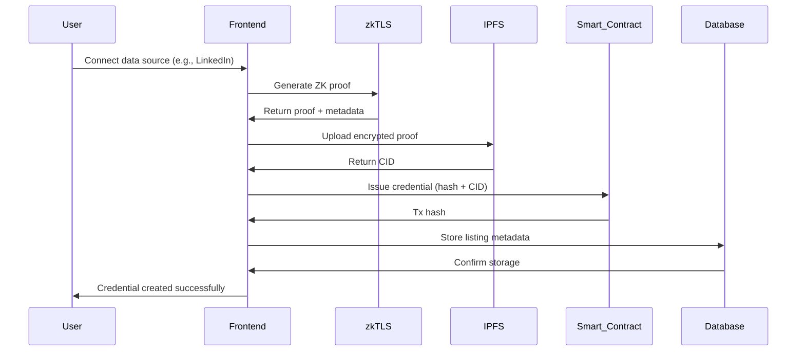
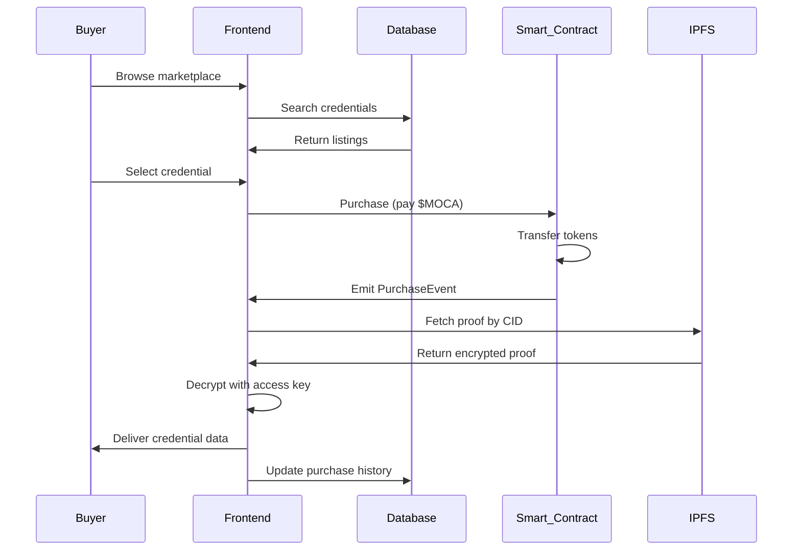
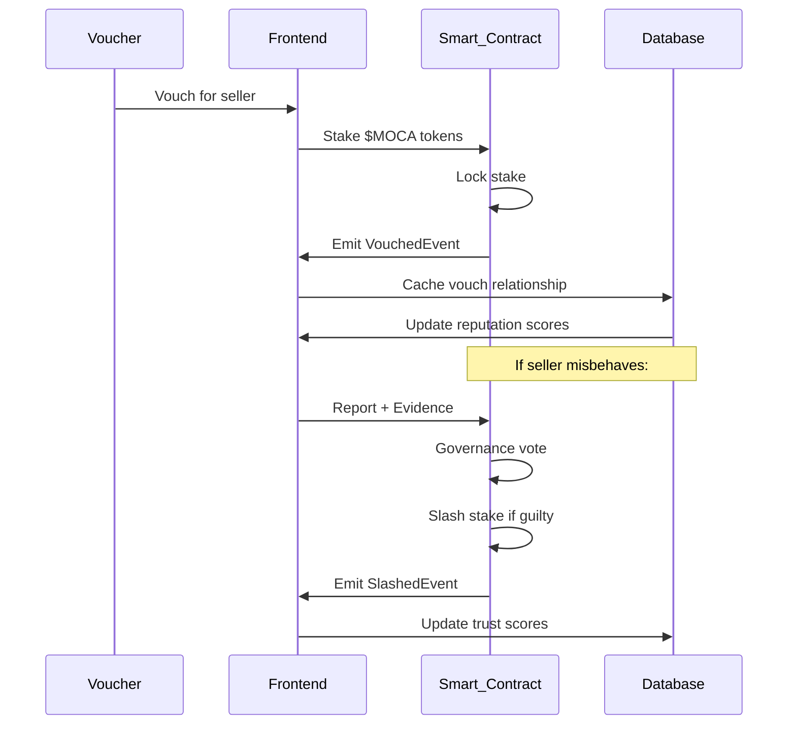

# Enclave Storage Architecture Plan

**Version 2.0 | Last Updated: October 19, 2025**

## Overview

This document outlines the comprehensive storage strategy for Enclave, a privacy-first data monetization marketplace where users generate Zero-Knowledge (ZK) credentials from their personal data and sell them to data buyers while maintaining complete privacy.

## Storage Architecture Decision

**Enclave uses a HYBRID STORAGE ARCHITECTURE:**

1. **PostgreSQL Database** - Operational data, marketplace listings, user sessions, transaction history
2. **On-Chain Storage (Moca Chain)** - Credential hashes, marketplace contracts, governance data, trust scores
3. **IPFS/Arweave** - ZK proofs, credential metadata, encrypted data packages
4. **Smart Contracts** - Credential registry, marketplace logic, payments, vouching/slashing

## Core Storage Principles

1. **Privacy-First**: No raw PII stored; only ZK credential hashes and proofs
2. **Decentralization**: Critical data on-chain or IPFS; database for fast queries only
3. **Immutability**: Credential proofs and transactions permanently stored
4. **Scalability**: Layered architecture with off-chain indexing for performance

## Storage Components

### 1. Database Storage (PostgreSQL)

#### Purpose

Fast, relational storage for operational data requiring complex queries, marketplace listings, and user interfaces.

#### Technology Stack

- **Database:** PostgreSQL 15+
- **ORM:** Prisma
- **Hosting:** Railway/Supabase/Vercel Postgres
- **Backup:** Automated daily backups + transaction log archiving

#### Data Categories

**User Management:**

- Moca wallet addresses (no PII)
- User preferences and UI settings
- Session tokens (JWT with 24h expiry)
- Login history and security logs

**Marketplace Operations:**

- Credential listing metadata (type, price, description)
- Purchase history (buyer-seller mapping)
- Search indexes for credential discovery
- Category and tag management

**Trust System:**

- Vouching relationships (on-chain hash + off-chain cache)
- Slashing events and dispute logs
- Reputation score cache (derived from on-chain data)
- Trust network graph (adjacency lists)

**Platform Analytics:**

- Aggregated marketplace metrics (no PII)
- Credential type popularity trends
- Revenue analytics (in $MOCA tokens)
- Network health monitoring

#### Database Schema

```sql
-- User management (wallet-based identity)
CREATE TABLE users (
    id UUID PRIMARY KEY DEFAULT gen_random_uuid(),
    wallet_address VARCHAR(42) UNIQUE NOT NULL,
    display_name VARCHAR(100),
    avatar_url TEXT,
    created_at TIMESTAMP DEFAULT NOW(),
    updated_at TIMESTAMP DEFAULT NOW(),
    last_active TIMESTAMP DEFAULT NOW(),
    is_active BOOLEAN DEFAULT true,
    reputation_score INTEGER DEFAULT 0, -- Cache of on-chain reputation
    total_vouches INTEGER DEFAULT 0,
    total_slashes INTEGER DEFAULT 0
);

-- Credential listings (marketplace inventory)
CREATE TABLE credential_listings (
    id UUID PRIMARY KEY DEFAULT gen_random_uuid(),
    seller_id UUID REFERENCES users(id) ON DELETE CASCADE,
    credential_type VARCHAR(50) NOT NULL, -- 'education', 'employment', 'financial', 'identity', 'health'
    title VARCHAR(200) NOT NULL,
    description TEXT,
    price_moca DECIMAL(18,8) NOT NULL,
    credential_hash VARCHAR(66) NOT NULL, -- Keccak256 hash of ZK proof (references on-chain)
    ipfs_cid VARCHAR(64), -- IPFS CID for ZK proof data
    metadata JSONB DEFAULT '{}', -- Tags, categories, attributes
    status VARCHAR(20) DEFAULT 'active', -- 'active', 'sold', 'removed', 'disputed'
    purchase_count INTEGER DEFAULT 0,
    view_count INTEGER DEFAULT 0,
    created_at TIMESTAMP DEFAULT NOW(),
    updated_at TIMESTAMP DEFAULT NOW()
);

-- Purchase transactions (marketplace history)
CREATE TABLE purchases (
    id UUID PRIMARY KEY DEFAULT gen_random_uuid(),
    listing_id UUID REFERENCES credential_listings(id),
    buyer_id UUID REFERENCES users(id) ON DELETE SET NULL,
    seller_id UUID REFERENCES users(id) ON DELETE SET NULL,
    price_moca DECIMAL(18,8) NOT NULL,
    tx_hash VARCHAR(66) NOT NULL, -- Moca Chain transaction hash
    credential_hash VARCHAR(66) NOT NULL,
    access_key_encrypted TEXT, -- Encrypted ZK proof access key
    status VARCHAR(20) DEFAULT 'completed', -- 'completed', 'disputed', 'refunded'
    created_at TIMESTAMP DEFAULT NOW()
);

-- Vouching relationships (trust network cache)
CREATE TABLE vouches (
    id UUID PRIMARY KEY DEFAULT gen_random_uuid(),
    voucher_id UUID REFERENCES users(id) ON DELETE CASCADE,
    vouchee_id UUID REFERENCES users(id) ON DELETE CASCADE,
    stake_amount DECIMAL(18,8) NOT NULL, -- $MOCA staked
    tx_hash VARCHAR(66) NOT NULL, -- On-chain vouching transaction
    status VARCHAR(20) DEFAULT 'active', -- 'active', 'slashed', 'withdrawn'
    created_at TIMESTAMP DEFAULT NOW(),
    updated_at TIMESTAMP DEFAULT NOW(),
    UNIQUE(voucher_id, vouchee_id)
);

-- Slashing events (trust system enforcement)
CREATE TABLE slashing_events (
    id UUID PRIMARY KEY DEFAULT gen_random_uuid(),
    slashed_user_id UUID REFERENCES users(id),
    voucher_id UUID REFERENCES users(id),
    reason TEXT NOT NULL,
    evidence_ipfs VARCHAR(64), -- IPFS CID for evidence
    slashed_amount DECIMAL(18,8) NOT NULL,
    tx_hash VARCHAR(66) NOT NULL,
    governance_vote_id INTEGER, -- Reference to on-chain governance proposal
    created_at TIMESTAMP DEFAULT NOW()
);

-- Credential types (schema definitions)
CREATE TABLE credential_schemas (
    id UUID PRIMARY KEY DEFAULT gen_random_uuid(),
    type_name VARCHAR(50) UNIQUE NOT NULL,
    description TEXT,
    json_schema JSONB NOT NULL, -- JSON Schema for credential structure
    zkp_circuit_cid VARCHAR(64), -- IPFS CID for zk-SNARK circuit
    is_active BOOLEAN DEFAULT true,
    created_at TIMESTAMP DEFAULT NOW(),
    updated_at TIMESTAMP DEFAULT NOW()
);

-- Analytics (aggregated, privacy-preserving)
CREATE TABLE marketplace_analytics (
    id UUID PRIMARY KEY DEFAULT gen_random_uuid(),
    metric_type VARCHAR(50) NOT NULL, -- 'listing_created', 'purchase', 'vouch', 'slash'
    credential_type VARCHAR(50),
    count INTEGER DEFAULT 1,
    revenue_moca DECIMAL(18,8),
    date DATE NOT NULL DEFAULT CURRENT_DATE,
    hour INTEGER, -- 0-23 for hourly analytics
    metadata JSONB DEFAULT '{}',
    created_at TIMESTAMP DEFAULT NOW()
);

-- Platform configuration
CREATE TABLE platform_config (
    key VARCHAR(100) PRIMARY KEY,
    value JSONB NOT NULL,
    description TEXT,
    updated_at TIMESTAMP DEFAULT NOW()
);

-- Audit logs (security and compliance)
CREATE TABLE audit_logs (
    id UUID PRIMARY KEY DEFAULT gen_random_uuid(),
    user_id UUID REFERENCES users(id),
    action VARCHAR(100) NOT NULL, -- 'credential_created', 'purchase', 'vouch', 'slash'
    resource_type VARCHAR(50),
    resource_id UUID,
    tx_hash VARCHAR(66), -- Link to blockchain transaction if applicable
    ip_address INET,
    user_agent TEXT,
    created_at TIMESTAMP DEFAULT NOW()
);
```

#### Performance Optimization

```sql
-- Indexes for optimal query performance
CREATE INDEX idx_users_wallet_address ON users(wallet_address);
CREATE INDEX idx_users_reputation ON users(reputation_score DESC, is_active);
CREATE INDEX idx_listings_seller_type ON credential_listings(seller_id, credential_type);
CREATE INDEX idx_listings_status_price ON credential_listings(status, price_moca);
CREATE INDEX idx_listings_type_created ON credential_listings(credential_type, created_at DESC);
CREATE INDEX idx_purchases_buyer_seller ON purchases(buyer_id, seller_id);
CREATE INDEX idx_purchases_tx_hash ON purchases(tx_hash);
CREATE INDEX idx_vouches_vouchee ON vouches(vouchee_id, status);
CREATE INDEX idx_slashing_user_date ON slashing_events(slashed_user_id, created_at);
CREATE INDEX idx_analytics_metric_date ON marketplace_analytics(metric_type, date);

-- Full-text search for credential discovery
CREATE INDEX idx_listings_search ON credential_listings USING gin(to_tsvector('english', title || ' ' || description));
```

### 2. On-Chain Storage (Moca Chain)

#### Purpose

Immutable, trustless storage for critical marketplace data, credential hashes, and governance.

#### Technology Stack

- **Blockchain:** Moca Chain (EVM-compatible)
- **Smart Contracts:** Solidity ^0.8.20
- **Deployment:** Hardhat with verify plugin
- **Indexing:** The Graph protocol for fast queries

#### Data Categories

**Credential Registry:**

- Credential hashes (keccak256 of ZK proofs)
- Issuer addresses (wallet addresses)
- Creation timestamps (block.timestamp)
- Revocation status (boolean flag)

**Marketplace Transactions:**

- Listing creation events (ListingCreated)
- Purchase events (CredentialPurchased)
- Price history (PriceUpdated events)
- Royalty payments (RoyaltyPaid events)

**Trust System:**

- Vouching stakes (Vouched events)
- Slashing penalties (Slashed events)
- Reputation scores (ReputationUpdated)
- Trust graph edges (VoucherAdded/Removed)

**Governance:**

- Proposal submissions (ProposalCreated)
- Voting records (Voted events)
- Execution results (ProposalExecuted)
- Parameter updates (ParameterChanged)

#### Smart Contract Architecture

**CredentialRegistry.sol** (93 lines)

```solidity
// SPDX-License-Identifier: MIT
pragma solidity ^0.8.20;

import "@openzeppelin/contracts/access/AccessControl.sol";
import "@openzeppelin/contracts/utils/ReentrancyGuard.sol";

contract CredentialRegistry is AccessControl, ReentrancyGuard {
    bytes32 public constant ISSUER_ROLE = keccak256("ISSUER_ROLE");

    struct Credential {
        bytes32 credentialHash; // keccak256 of ZK proof
        address issuer;
        uint256 timestamp;
        bool revoked;
        string ipfsCid; // IPFS CID for ZK proof data
    }

    mapping(bytes32 => Credential) public credentials;
    mapping(address => bytes32[]) public userCredentials;

    event CredentialIssued(bytes32 indexed credentialHash, address indexed issuer, string ipfsCid);
    event CredentialRevoked(bytes32 indexed credentialHash, address indexed issuer);

    constructor() {
        _grantRole(DEFAULT_ADMIN_ROLE, msg.sender);
    }

    function issueCredential(
        bytes32 credentialHash,
        string memory ipfsCid
    ) external onlyRole(ISSUER_ROLE) nonReentrant {
        require(credentials[credentialHash].issuer == address(0), "Credential already exists");

        credentials[credentialHash] = Credential({
            credentialHash: credentialHash,
            issuer: msg.sender,
            timestamp: block.timestamp,
            revoked: false,
            ipfsCid: ipfsCid
        });

        userCredentials[msg.sender].push(credentialHash);

        emit CredentialIssued(credentialHash, msg.sender, ipfsCid);
    }

    function revokeCredential(bytes32 credentialHash) external {
        require(credentials[credentialHash].issuer == msg.sender, "Not issuer");
        require(!credentials[credentialHash].revoked, "Already revoked");

        credentials[credentialHash].revoked = true;

        emit CredentialRevoked(credentialHash, msg.sender);
    }

    function verifyCredential(bytes32 credentialHash) external view returns (bool) {
        return credentials[credentialHash].issuer != address(0) && !credentials[credentialHash].revoked;
    }

    function getCredential(bytes32 credentialHash) external view returns (Credential memory) {
        return credentials[credentialHash];
    }

    function getUserCredentials(address user) external view returns (bytes32[] memory) {
        return userCredentials[user];
    }
}
```

**MarketplaceContract.sol** (See Tech PRD.md for full 140-line implementation)

**GovernanceContract.sol** (See Tech PRD.md for full 180-line implementation)

### 3. IPFS/Arweave Storage

#### Purpose

Permanent, decentralized storage for ZK proofs, credential metadata, and immutable records.

#### Technology Stack

- **IPFS:** Content-addressed storage via Pinata
- **Arweave:** Permanent storage for critical proofs (pay-once, store-forever)
- **Encryption:** AES-256-GCM for sensitive data
- **CDN:** Pinata Gateway for fast global delivery

#### Data Categories

**ZK Proof Data:**

- Zero-knowledge proofs (zk-SNARKs generated by zkTLS)
- Proof metadata (circuit type, public inputs)
- Verification keys
- Witness data (encrypted)

**Credential Metadata:**

- Credential schema definitions (JSON Schema format)
- Category taxonomies
- Tag mappings
- Search indexes

**Immutable Records:**

- Marketplace transaction receipts
- Dispute evidence (screenshots, documents)
- Governance proposal documents
- Audit trail snapshots

#### IPFS Integration Architecture

```typescript
// src/lib/services/ipfsStorage.ts
import { PinataSDK } from 'pinata';
import { create as createIPFSClient } from 'ipfs-http-client';
import { encryptData, decryptData } from '$lib/crypto/encryption';

export class IPFSStorageService {
	private pinata: PinataSDK;

	constructor() {
		this.pinata = new PinataSDK({
			pinataJwt: process.env.PINATA_JWT!,
			pinataGateway: process.env.PINATA_GATEWAY_URL!
		});
	}

	// Upload ZK proof to IPFS with encryption
	async uploadZKProof(
		proof: object,
		encrypt: boolean = true
	): Promise<{
		ipfsCid: string;
		encryptionKey?: string;
	}> {
		let dataToUpload = proof;
		let encryptionKey: string | undefined;

		if (encrypt) {
			const { encrypted, key } = await encryptData(JSON.stringify(proof));
			dataToUpload = { encrypted };
			encryptionKey = key;
		}

		const blob = new Blob([JSON.stringify(dataToUpload)], { type: 'application/json' });
		const file = new File([blob], 'zkproof.json');

		const result = await this.pinata.upload.file(file, {
			metadata: {
				name: 'ZK Proof',
				keyValues: {
					type: 'zk-proof',
					encrypted: encrypt.toString(),
					timestamp: new Date().toISOString()
				}
			}
		});

		return {
			ipfsCid: result.IpfsHash,
			encryptionKey
		};
	}

	// Retrieve and decrypt ZK proof
	async getZKProof(ipfsCid: string, encryptionKey?: string): Promise<object> {
		const response = await fetch(`${process.env.PINATA_GATEWAY_URL}/ipfs/${ipfsCid}`);
		const data = await response.json();

		if (encryptionKey && data.encrypted) {
			const decrypted = await decryptData(data.encrypted, encryptionKey);
			return JSON.parse(decrypted);
		}

		return data;
	}

	// Upload credential metadata
	async uploadCredentialMetadata(metadata: {
		type: string;
		schema: object;
		attributes: Record<string, any>;
	}): Promise<string> {
		const blob = new Blob([JSON.stringify(metadata)], { type: 'application/json' });
		const file = new File([blob], 'credential-metadata.json');

		const result = await this.pinata.upload.file(file, {
			metadata: {
				name: `Credential: ${metadata.type}`,
				keyValues: {
					credentialType: metadata.type,
					timestamp: new Date().toISOString()
				}
			}
		});

		return result.IpfsHash;
	}

	// Pin existing IPFS content (from zkTLS generation)
	async pinByCID(cid: string): Promise<void> {
		await this.pinata.pin.cid(cid);
	}
}
```

#### Arweave Integration (Permanent Storage)

```typescript
// src/lib/services/arweaveStorage.ts
import Arweave from 'arweave';
import { JWKInterface } from 'arweave/node/lib/wallet';

export class ArweaveStorageService {
	private arweave: Arweave;
	private wallet: JWKInterface;

	constructor() {
		this.arweave = Arweave.init({
			host: 'arweave.net',
			port: 443,
			protocol: 'https'
		});

		// Load wallet from secure environment
		this.wallet = JSON.parse(process.env.ARWEAVE_KEY!);
	}

	// Store critical proof permanently
	async storeProofPermanently(
		proof: object,
		metadata: {
			credentialType: string;
			issuer: string;
			timestamp: number;
		}
	): Promise<string> {
		const data = JSON.stringify(proof);

		const transaction = await this.arweave.createTransaction(
			{
				data
			},
			this.wallet
		);

		// Add tags for discovery
		transaction.addTag('App-Name', 'Enclave');
		transaction.addTag('Content-Type', 'application/json');
		transaction.addTag('Type', 'ZK-Proof');
		transaction.addTag('Credential-Type', metadata.credentialType);
		transaction.addTag('Issuer', metadata.issuer);
		transaction.addTag('Timestamp', metadata.timestamp.toString());

		await this.arweave.transactions.sign(transaction, this.wallet);
		await this.arweave.transactions.post(transaction);

		return transaction.id; // Arweave transaction ID
	}

	// Retrieve proof from Arweave
	async getProof(txId: string): Promise<object> {
		const data = await this.arweave.transactions.getData(txId, {
			decode: true,
			string: true
		});

		return JSON.parse(data as string);
	}
}
```

### 4. Smart Contract Storage Patterns

#### Storage Optimization Patterns

**Minimize On-Chain Data:**

```solidity
// Store only hashes on-chain, full data on IPFS
struct Listing {
    bytes32 credentialHash; // 32 bytes
    address seller; // 20 bytes
    uint256 price; // 32 bytes
    string ipfsCid; // ~50 bytes (CID string)
    // Total: ~134 bytes vs storing full proof (~10KB+)
}
```

**Event-Driven Architecture:**

```solidity
// Emit events for off-chain indexing (The Graph)
event CredentialListed(
    bytes32 indexed credentialHash,
    address indexed seller,
    uint256 price,
    string ipfsCid,
    uint256 timestamp
);

event CredentialPurchased(
    bytes32 indexed credentialHash,
    address indexed buyer,
    address indexed seller,
    uint256 price,
    uint256 timestamp
);
```

**Batch Operations:**

```solidity
// Batch credential issuance for gas efficiency
function batchIssueCredentials(
    bytes32[] calldata credentialHashes,
    string[] calldata ipfsCids
) external {
    require(credentialHashes.length == ipfsCids.length, "Length mismatch");

    for (uint i = 0; i < credentialHashes.length; i++) {
        _issueCredential(credentialHashes[i], ipfsCids[i]);
    }
}
```

## Data Flow Architecture

### Credential Creation Flow



### Marketplace Purchase Flow



### Trust System Flow (Vouching)



## Data Retention & Privacy

### Privacy Principles

1. **Zero-Knowledge Storage**: No raw PII stored anywhere
2. **Credential Hashing**: Only keccak256 hashes on-chain
3. **Encrypted IPFS**: ZK proofs encrypted with buyer-only access keys
4. **Right to Deletion**: Users can revoke credentials (mark as revoked on-chain)

### Retention Policy

| Data Type            | Retention Period     | Storage Location | Deletion Process                                     |
| -------------------- | -------------------- | ---------------- | ---------------------------------------------------- |
| User Sessions        | 24 hours             | PostgreSQL       | Auto-expire                                          |
| Marketplace Listings | Until seller removes | Database + Chain | Soft delete (DB), revoke flag (chain)                |
| ZK Proofs            | Permanent            | IPFS/Arweave     | Cannot delete (immutable), revoke credential instead |
| Transaction History  | Permanent            | On-chain         | Cannot delete (blockchain property)                  |
| Purchase Records     | 7 years (compliance) | Database         | Archive after 7 years                                |
| Audit Logs           | 2 years              | PostgreSQL       | Rolling deletion                                     |

### GDPR Compliance

**Right to Erasure Implementation:**

```typescript
// Pseudonymization: Wallet addresses as identifiers (no PII)
// Credential revocation instead of deletion
async revokeCredential(credentialHash: string, userId: string) {
	// 1. Mark as revoked on-chain (permanent flag)
	await credentialContract.revokeCredential(credentialHash);

	// 2. Remove from marketplace listings
	await db.credentialListings.update({
		where: { credentialHash },
		data: { status: 'revoked' }
	});

	// 3. Clear cached proof from IPFS (unpin)
	await ipfsService.unpin(credentialHash);

	// 4. Anonymize database records
	await db.users.update({
		where: { id: userId },
		data: {
			display_name: '[DELETED]',
			avatar_url: null
		}
	});
}
```

## Backup & Disaster Recovery

### Backup Strategy

**Database (PostgreSQL):**

- **Frequency:** Automated snapshots every 6 hours
- **Retention:** 30 days of point-in-time recovery
- **Storage:** Railway/Supabase automated backups
- **Testing:** Monthly restore tests to staging environment

**IPFS (Pinata):**

- **Redundancy:** Multi-region pinning (3 regions minimum)
- **Backup:** Secondary pinning to Filebase or Web3.Storage
- **Verification:** Weekly CID integrity checks
- **Recovery:** Automated re-pinning on failure detection

**Smart Contracts:**

- **Immutability:** Code cannot be deleted once deployed
- **Upgradability:** Proxy pattern for critical bug fixes
- **Archive Nodes:** Full blockchain history preserved by Moca Chain validators
- **Event Indexing:** The Graph subgraph as secondary data source

### Disaster Recovery Plan

**Scenario 1: Database Failure**

1. Detect failure via health checks (30s interval)
2. Automatic failover to read replica (<2 min)
3. Restore from latest snapshot (target: <15 min)
4. Rebuild indexes and validate data integrity
5. Resume normal operations

**Scenario 2: IPFS Pinning Service Outage**

1. Detect via gateway health checks
2. Failover to secondary pinning service (Filebase)
3. Re-pin critical CIDs to new service
4. Update gateway URLs in database
5. Resume content delivery

**Scenario 3: Smart Contract Exploit**

1. Pause contract via emergency stop function
2. Assess vulnerability and impact
3. Deploy patched contract via proxy upgrade
4. Compensate affected users from treasury
5. Post-mortem and security audit

## Scaling Considerations

### Performance Targets

| Metric               | Target           | Current Capacity     | Scaling Strategy                  |
| -------------------- | ---------------- | -------------------- | --------------------------------- |
| Database Queries     | <100ms p95       | 10K QPS              | Read replicas, query optimization |
| IPFS Retrieval       | <500ms p95       | 1K req/s             | CDN caching, regional gateways    |
| Smart Contract Calls | <3s (block time) | 500 TPS (Moca Chain) | Batch operations, L2 if needed    |
| Search Response      | <200ms p95       | 5K searches/min      | Elasticsearch integration         |

### Horizontal Scaling

**Database Sharding Strategy:**

```sql
-- Shard by user wallet address (first 2 bytes)
CREATE TABLE credential_listings_00 PARTITION OF credential_listings
FOR VALUES FROM ('0x00000000') TO ('0x00FFFFFF');

CREATE TABLE credential_listings_01 PARTITION OF credential_listings
FOR VALUES FROM ('0x01000000') TO ('0x01FFFFFF');

-- Continue for all shards...
```

**IPFS Load Balancing:**

```typescript
// Round-robin across multiple gateways
const gateways = [
	'https://gateway1.pinata.cloud',
	'https://gateway2.pinata.cloud',
	'https://dweb.link'
];

let currentIndex = 0;

function getNextGateway(): string {
	const gateway = gateways[currentIndex];
	currentIndex = (currentIndex + 1) % gateways.length;
	return gateway;
}
```

## Monitoring & Observability

### Key Metrics

**Storage Metrics:**

- Database size and growth rate
- IPFS pin count and storage usage
- Smart contract state size
- Query response times (p50, p95, p99)

**Business Metrics:**

- Credentials issued per day
- Marketplace transactions volume
- Trust system activity (vouches, slashes)
- Revenue in $MOCA tokens

### Monitoring Stack

```yaml
# Prometheus metrics
- postgres_connections_active
- ipfs_pins_total
- smart_contract_gas_used
- marketplace_listings_active

# Grafana dashboards
- Database performance
- IPFS health
- Blockchain metrics
- Marketplace analytics

# Alerts
- Database CPU > 80% for 5min
- IPFS gateway latency > 1s
- Smart contract out of gas
- Unusual transaction volume
```

## Cost Analysis

### Monthly Storage Costs (10K Users)

| Service              | Usage            | Cost/Month      | Notes                  |
| -------------------- | ---------------- | --------------- | ---------------------- |
| PostgreSQL (Railway) | 10GB database    | $20             | Includes backups       |
| Pinata IPFS          | 100GB pinned     | $20             | Free tier + paid       |
| Arweave (permanent)  | 10GB uploaded    | $50 one-time    | Pay-once model         |
| Moca Chain gas       | 50K transactions | $100 (est.)     | Depends on gas price   |
| **Total**            |                  | **~$140/month** | + $50 one-time Arweave |

### Scaling Cost Projections

**100K Users:**

- Database: $200/month (100GB, 50K QPS)
- IPFS: $200/month (1TB pinned)
- Arweave: $500 one-time (100GB)
- Gas: $1,000/month (500K txs)
- **Total: ~$1,400/month**

**1M Users:**

- Database: $2,000/month (1TB, sharded)
- IPFS: $2,000/month (10TB pinned)
- Arweave: $5,000 one-time (1TB)
- Gas: $10,000/month (5M txs)
- **Total: ~$14,000/month**

## Implementation Checklist

### Phase 1: Core Infrastructure (Weeks 1-4)

- [ ] Set up PostgreSQL database with schema
- [ ] Configure Pinata IPFS account + SDK integration
- [ ] Deploy smart contracts to Moca testnet
- [ ] Implement basic CRUD operations for credentials
- [ ] Set up monitoring (Prometheus + Grafana)

### Phase 2: Marketplace Features (Weeks 5-8)

- [ ] Build credential listing functionality
- [ ] Implement purchase flow with $MOCA payments
- [ ] Add search and filtering (PostgreSQL full-text)
- [ ] Integrate The Graph for on-chain event indexing
- [ ] Deploy to Moca mainnet

### Phase 3: Trust System (Weeks 9-12)

- [ ] Implement vouching smart contract
- [ ] Build slashing mechanism with governance
- [ ] Add reputation score calculations
- [ ] Create trust network visualization
- [ ] Security audit of trust contracts

### Phase 4: Optimization (Weeks 13-16)

- [ ] Add Arweave integration for critical proofs
- [ ] Implement database sharding
- [ ] Set up CDN caching for IPFS content
- [ ] Optimize smart contract gas usage
- [ ] Load testing and performance tuning

---

**Document Version:** 2.0  
**Last Updated:** October 19, 2025  
**Maintained By:** Enclave Core Team
